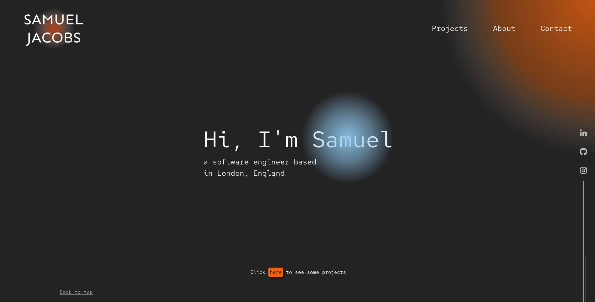

# Portfolio Website Rebuild In React

## Project Overview

The purpose of this project was to rebuild my personal portfolio website that was originally built as my first project during my Nology course. The original website was built using HTML, CSS, and JavaScript whereas this rebuild was completed with React.

## Links to Project

### Deployed Site

https://samueljacobs98.github.io/portfolio-website-react/

### GitHub Repo

https://github.com/samueljacobs98/portfolio-website-react
